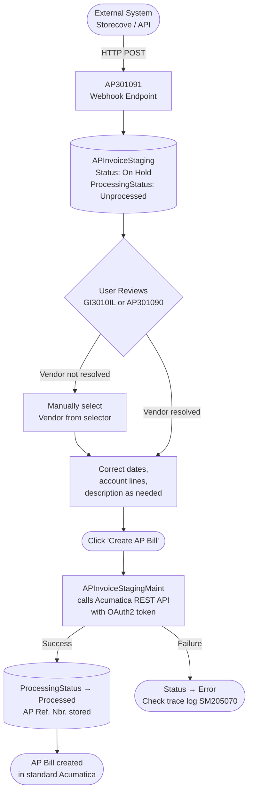

# AP Staging Module

## Overview

The AP Staging module provides an intermediate holding area for vendor invoices received from external systems (e.g. Storecove e-invoicing platform) via webhook. Invoices land in staging first, allowing users to review and correct them before creating official AP Bills in Acumatica.

---

## Screens

| Screen ID   | Title                  | URL                              |
|-------------|------------------------|----------------------------------|
| GI3010IL    | AP Staging (List)      | `Accounts Payable > AP Staging Form` (GI) |
| AP301090    | AP Staging Form        | `Accounts Payable > AP Staging Form` |
| AP301091    | AP Staging Webhook     | Internal — used by external systems only |
| AP301092    | AP Staging Preferences | `Accounts Payable > Preferences > AP Staging Preferences` |

---

## Workflow



---

## Screens in Detail

### GI3010IL — AP Staging List (Generic Inquiry)

The main list view. Use this to get an overview of all staging records.

**Columns displayed:**
- Staging ID, Doc. Type, Vendor, Vendor Name
- Invoice Nbr., Doc. Date, Due Date, Currency
- Description, Status, Processing Status
- AP Doc. Type, AP Ref. Nbr. (populated after AP Bill is created)
- Branch, Terms, Created

**Filters:**
| Filter | Behaviour |
|--------|-----------|
| Vendor Name | Partial match (contains) |
| Status | Exact match — On Hold / Open / Error |
| Proc. Status | Exact match — Unprocessed / Processed |
| Doc Date From | Records on or after this date |
| Doc Date To | Records on or before this date |

**Navigation:** Click any record row to open it in the AP Staging Form (AP301090).

---

### AP301090 — AP Staging Form

The detail entry form for a single staging record.

**Header fields:**

| Group    | Field              | Notes                                      |
|----------|--------------------|--------------------------------------------|
| Vendor   | Vendor             | Selector — auto-fills Location, Terms, Currency |
|          | Vendor Name        | Free-text name sent by external system     |
|          | Vendor Location    |                                            |
|          | Branch             |                                            |
| Dates    | Doc. Date          |                                            |
|          | Due Date           |                                            |
|          | Discount Date      |                                            |
|          | Pay Date           |                                            |
|          | Fin. Period        |                                            |
| Document | Doc Type           | Invoice / Credit Adj / Debit Adj / Prepayment |
|          | Invoice Nbr.       | Vendor's original invoice number           |
|          | Terms              |                                            |
|          | Currency           |                                            |
|          | Status             | On Hold / Open / Error                     |
|          | Processing Status  | Unprocessed / Processed (read-only)        |

**Second row:**
- Description (full width)
- Created AP Bill group — AP Doc. Type and AP Ref. Nbr. (read-only, populated after processing)

**Details tab — line items:**

| Column | Notes |
|--------|-------|
| Branch | |
| Account | GL expense account |
| Subaccount | |
| Transaction Descr. | Line description |
| Qty | Quantity |
| Unit Price | Per-unit cost |
| Discount Amount | |
| Amount | Auto-calculated: (Qty × Unit Price) − Discount. Read-only. |
| Project | |

**Financial tab:**
- AP Account, AP Subaccount
- Branch, Pay Date, Vendor Location

**Toolbar action — Create AP Bill:**
1. Saves the current record.
2. Calls the Acumatica REST API (using credentials from Preferences) to create an AP Bill with all line items.
3. On success, sets Processing Status to **Processed** and stores the AP Ref. Nbr.

> The operation runs asynchronously. A progress spinner will appear — wait for it to complete before navigating away.

---

### AP301091 — Webhook Endpoint

This screen is used exclusively by external systems to push invoice data into the staging table. It is not intended for manual use.

**Typical payload fields:**
- `VendorName`, `DocDate`, `InvoiceNbr`, `Description`
- `DueDate`, `CuryID`, `DocType`
- `Details[]` — array of line items with `AccountID`, `SubID`, `Qty`, `UnitCost`, `DiscountAmt`, `TransactionDescr`

> When a vendor name is received, the system attempts to auto-resolve it to an Acumatica Vendor ID via an exact then partial name match.

---

### AP301092 — AP Staging Preferences

Configure the connection settings for the REST API used by the Create AP Bill action.

| Field | Description |
|-------|-------------|
| Acumatica Base URL | Base URL of the Acumatica instance, e.g. `http://localhost/saga` |
| Client ID | OAuth2 client ID registered in Acumatica |
| Client Secret | OAuth2 client secret (stored encrypted) |
| Username | Acumatica user account for API calls |
| Password | Password (stored encrypted) |
| Scope | OAuth2 scope — defaults to `api` if left blank |
| Entity Endpoint (APStaging) | REST endpoint for the APStaging entity, e.g. `/entity/APStaging/24.200.001/APStaging` |
| Action Endpoint (Bill) | REST endpoint for creating bills, e.g. `/entity/APStaging/24.200.001/Bill` |
| Storecove Base URL | Base URL of the Storecove e-invoicing API |
| Storecove Token | API bearer token for Storecove (stored encrypted) |

> Must be configured before clicking "Create AP Bill" on any staging record.

---

## Status Reference

### Status (document state)

| Code | Label    | Meaning                              |
|------|----------|--------------------------------------|
| H    | On Hold  | Default. Record is under review.     |
| O    | Open     | Ready for processing.                |
| E    | Error    | An error occurred during processing. |

### Processing Status

| Code | Label       | Meaning                                       |
|------|-------------|-----------------------------------------------|
| U    | Unprocessed | AP Bill has not yet been created.             |
| P    | Processed   | AP Bill was successfully created via the API. |

---

## Amount Calculation

Line item amounts are calculated as:

```
Amount = (Qty × Unit Price) − Discount Amount
```

This is computed automatically:
- In the UI via a PXFormula when editing through the form.
- On save via a `RowPersisting` event handler — this covers records inserted directly via the webhook/API that bypass the UI formula.

---

## Customization Project

- **Project name:** APStaging
- **Published to:** All companies

**Key files:**

| File | Purpose |
|------|---------|
| `DAC/APInvoiceStaging.cs` | Header DAC (main staging record) |
| `DAC/APInvoiceStagingDetail.cs` | Line item DAC |
| `DAC/APInvoiceStagingPayment.cs` | Payment/financial info DAC |
| `DAC/APStagingPreferences.cs` | Preferences/settings DAC |
| `Graph/APInvoiceStagingMaint.cs` | Main graph — business logic, Create AP Bill action |
| `Graph/APStagingSetupMaint.cs` | Preferences graph |
| `Pages/AP301090.aspx` | AP Staging Form (entry) |
| `Pages/AP301092.aspx` | AP Staging Preferences screen |

---

## Troubleshooting

**"Preferences not set up" error when clicking Create AP Bill**
> Open AP Staging Preferences (AP301092) and fill in all required API connection fields.

**Processing Status stays Unprocessed after Create AP Bill**
> Check the Acumatica trace log (SM205070) for API errors. Common causes: wrong Base URL, invalid credentials, or endpoint path mismatch.

**Vendor not resolved (VendorID is empty)**
> The webhook sent a vendor name that doesn't match any Acumatica vendor by exact or partial name. Open the record and manually select the Vendor from the selector.

**Amount column shows 0 or is blank**
> Run the following SQL to backfill existing records:
> ```sql
> UPDATE APInvoiceStagingDetail
> SET Amount = (ISNULL(Qty, 0) * ISNULL(UnitCost, 0)) - ISNULL(DiscountAmt, 0)
> WHERE Amount IS NULL OR Amount = 0
> ```

**Publish fails with "Cannot access uploaded file"**
> There are broken UploadFileRevision records in the database. Run `C:\Temp\fix_all_broken_aggressive.ps1` to clean them up before publishing.